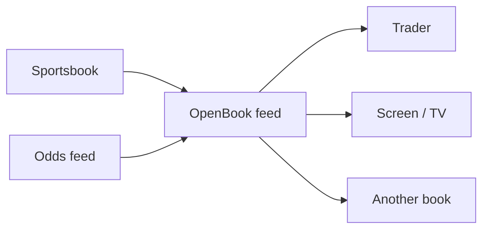
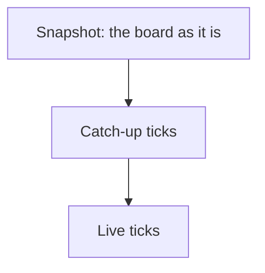
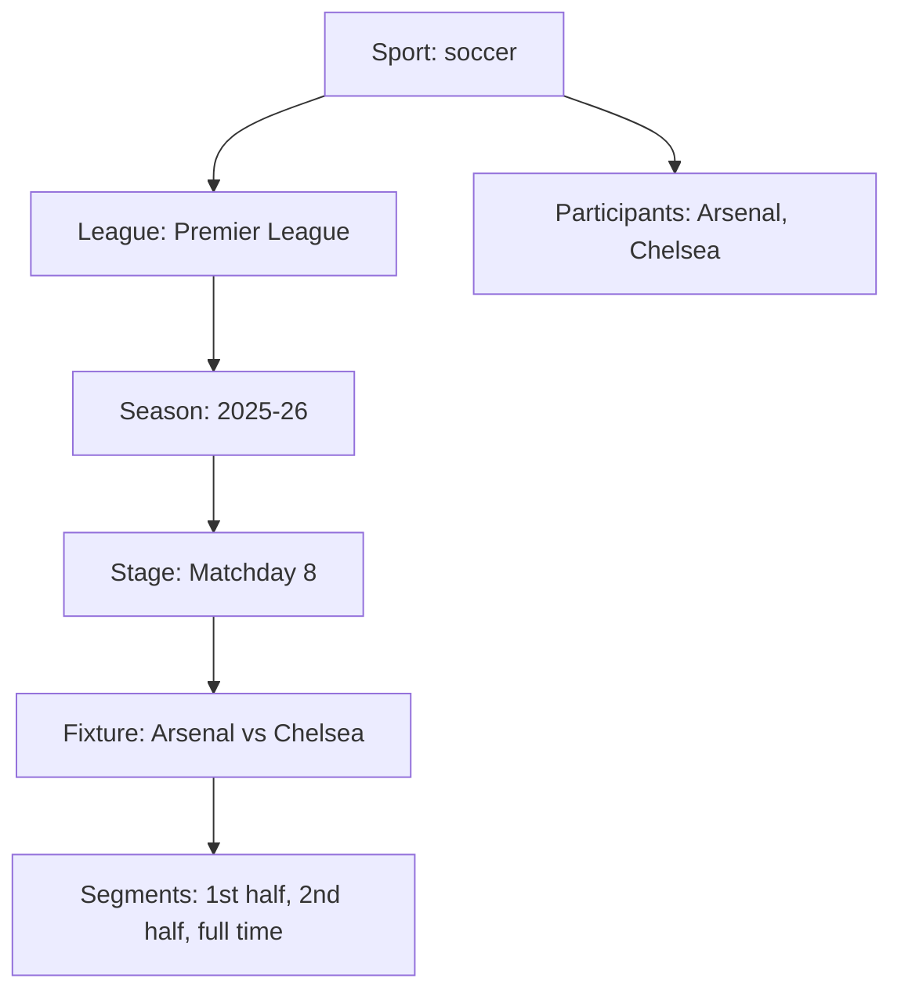
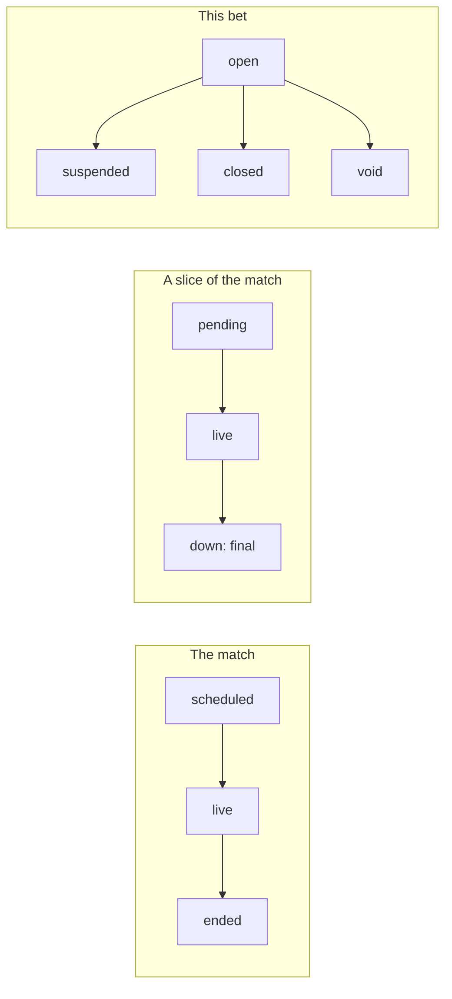

# OpenBook in plain language

This page is for people who need to **understand** OpenBook, not implement it.
No RFC keywords. No topic grammar. Those live in the
[specification](../spec/openbook.md).

The shared lists of sports, bet types, and match slices live in the
[taxonomy](taxonomy.md) — separate again, so you can talk about “what a total
is” without talking about JSON.

---

## What it is

OpenBook is a **shared way to write down sportsbook data** so that:

- a sportsbook can publish its own prices
- a feed can carry many books in one stream
- a consumer (trader, screen, researcher, regulator, another book) can read
  every publisher with **one** importer

It is only the data contract. How a book prices, models, or hedges stays
private. Think of a bus timetable standard: every agency publishes the same
*shape* of file; nobody has to reveal how they schedule the buses.

Three roles:

| Role | Everyday meaning |
| --- | --- |
| Publisher | Whoever *transmits* the feed (a book, or a company that carries books) |
| Source | Whose odds a price actually is — every price names this |
| Consumer | Whoever *reads* feeds |

One feed may carry many sources, the way one transit file can list many bus
operators.

---

## Two layers, like a matchday board

| Layer | What it is | Sportsbook feel |
| --- | --- | --- |
| Catalogue | The durable facts: which league, which teams, which match, which kind of bet | The printed fixture list |
| Live wire | Only what *changed*: a price tick, a goal, a market coming off | The board that keeps updating |

You do not re-send the whole board every time Arsenal’s moneyline moves a
tick. You send the tick. If someone joins late, they get a **snapshot** (the
board as it stands) and then the ticks from that point on.

---

## How a match is organised

A **fixture** is the thing you price: Arsenal vs Chelsea, Saturday 15:00.

Around it:

- A **league** is any recurring competition — league, cup, tournament, series.
  The FA Cup and the Premier League are both leagues in this sense.
- A **participant** is a team *or* a person (a tennis player, a driver). The
  same club can play the league and the cup in one week, so participants belong
  to a sport, not to a single league.
- A **player** is roster membership: this person, in this team, this number.
- A **segment** is a *slice inside* the match (first half, set 3, Q1). It is
  not a separate match.

Formula 1 is the useful exception: Qualifying, Sprint and Race are three
**fixtures** in one round. Q1 / Q2 / Q3 are segments of Qualifying.

The shared names for sports, segments and bet types are the
[taxonomy](taxonomy.md). Team names and match ids stay the publisher’s own;
OpenBook does not mint those.

---

## Three kinds of “what’s going on?”

These are easy to mix up. They answer three different questions.

| Question | Everyday | Example |
| --- | --- | --- |
| Is the event happening? | Fixture status | scheduled → live → ended |
| Where is the match, and is this slice finished? | Segment status | 1st half live; full time **down** (final) |
| Can you still bet this market? | Market status | open / suspended / closed / void |

**Down** on a segment means that slice is finished for grading. It happens
once. A wrong score later is an *erratum* (a correction), not a second
whistle.

Taking a market off the board is a market status — not a fake price of zero.

---

## A Saturday, in one story

Arsenal vs Chelsea, Premier League, 15:00.

**Before kick-off** the catalogue already says: this is soccer, this is the
Premier League, these two clubs, this start time. The board is offering a
moneyline, a spread, and a 2.5 total — three *kinds* of bet, each from a
named book.

**During the match** only the moving parts go out:

1. A tick — the over 2.5 shortens from 1.90 to 1.95. One price, not a new
   fixture list.
2. A goal — the score object updates; the clock keeps running.
3. The book takes a market off — that is a *status* on the market, not a
   pretend price of zero.

**At full time** the full-time slice is marked finished (once). Markets on
that slice close. The book then *grades* each market: win, lose, void, or
half. If the score was wrong, they send a correction — they do not blow the
whistle twice.

That is the whole model: a printed list, a board that ticks, a result that
is graded once. The same story as JSON — on a real sample fixture — is the
[examples page](examples.md).

---

## What you subscribe to

Everything about one match hangs off that match. If you care about Arsenal vs
Chelsea, you follow that fixture: prices, score, markets coming off, grades.

You do not need MQTT, or any particular pipe. OpenBook names the *message*,
not the transport.

---

## Who should read what

| You are… | Start here | Then |
| --- | --- | --- |
| Trading, ops, product, commercial | This guide | [Taxonomy](taxonomy.md) |
| Matching teams and leagues across books | [Taxonomy](taxonomy.md) | Spec §3 and §6 |
| Building a publisher or importer | [Specification](../spec/openbook.md) | [Examples](examples.md) then [Schemas](../schema/) |
| Asking *why* a rule exists | [Decision log](decisions.md) | — |

OpenBook is **not** a pricing engine, a matching service, or a requirement
to open your models. It is the shared shape of the file you emit.

---

## Where to go next

| If you want… | Read |
| --- | --- |
| Shared names for sports, bets, slices | [Taxonomy](taxonomy.md) then the [id lists](../vocabularies/) |
| The same story as JSON | [Examples](examples.md) |
| The rules implementers must follow | [The specification](../spec/openbook.md) |
| Why a rule exists | [Decision log](decisions.md) |
| Machine-checkable shapes | [JSON Schemas](../schema/) |
