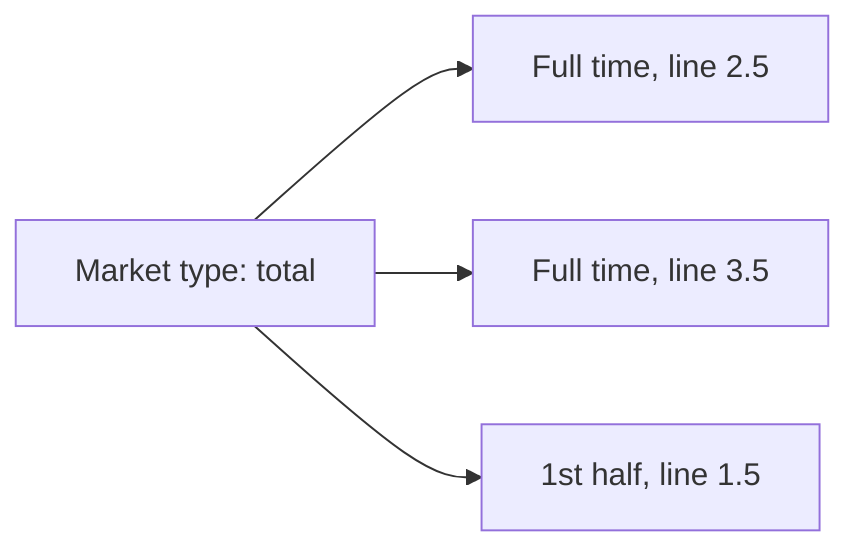

# Taxonomy — the shared lists, in plain language

This page is the **human** map of OpenBook’s shared names. It is not the
technical contract (that is the [spec](../spec/openbook.md)) and it is not
the full id list (that is [vocabularies](../vocabularies/)).

Use this when you need to agree what a word means — product, trading, ops,
legal — before anyone opens a schema.

---

## What is shared vs what a publisher owns

| Shared by the standard (same everywhere) | Each publisher’s own |
| --- | --- |
| Sport (soccer, tennis) | League id, season id, match id |
| Market type (moneyline, total, player points) | Team / player ids |
| Segment (1st half, set 3, Q1) | Venue id |
| Side (home, away, over, under) | How they spell “Man City” |
| | Wikidata link, when they have one, so others can match |

The shared ids look like `sport:soccer` or `market:total` on the wire. You do
not need those spellings to *talk* about the taxonomy; they are how computers
agree.

Once a shared id is published in a frozen version, it is never reused for
something else. If a name was a mistake, it is deprecated, not quietly
repurposed.

---

## Sport

The game being played. Soccer, basketball, tennis. Not “the Olympics” — that
is a competition (a league, in OpenBook’s terms) that contains many sports.

A few sports have **disciplines** underneath (100 m, marathon). Those are
still the same sport, sliced finer.

Catch-all: when a publisher sees a sport that is not on the list yet, they
should say “unknown” rather than invent a private code. The list grows by
proposal.

Full list: [sports vocabulary](../vocabularies/sports.md).

---

## League, season, stage

These are *competitions and their structure*, not the shared taxonomy of
sports — but they sit next to it, so the words stay consistent.

| Word | Means | Example |
| --- | --- | --- |
| League | Any recurring competition | Premier League, FA Cup, F1 World Championship |
| Season | One edition | 2025-26, F1 2026 |
| Stage | A named slice of a season, and stages can nest | Knockout → quarter-final → leg 2 |
| Fixture | The priced event | Arsenal vs Chelsea; F1 Race at Silverstone |
| Organizer | Who runs competitions | UEFA, NBA, FIA — one organizer, many leagues |

---

## Segment

A **segment** is a slice *inside* a match, used both for live state (“we are
in the first half”) and for which slice a bet is on (“first-half total”).

It is **not** a separate match. First half and full time of the same soccer
game are two segments of one fixture.

| Sport family | Typical slices |
| --- | --- |
| Soccer / rugby | 1st half, 2nd half, full time, extra time, penalties |
| Basketball / American football | Quarters, halves, overtime |
| Ice hockey | Periods, overtime, shootout |
| Tennis / volleyball | Sets, sometimes games |
| Motorsport | Q1/Q2/Q3 are segments of the Qualifying *fixture* |

Every sport has a “whole contest as graded” slice (usually called full time).

Full list: [segments vocabulary](../vocabularies/segments.md).

---

## Market type vs a priced market

Easy to mix up:

| Word | Means | Example |
| --- | --- | --- |
| Market type | The *kind* of bet, shared | Total (over/under) |
| Market | That kind of bet, on this match, this slice, this line, from this book | Pinnacle’s 2.5 full-time total on EVT-88213 |
| Side | Which selection | over, under, home, away |
| Line | The number on a handicap or total | 2.5 |

The same market type can be offered on many segments (full time *and* first
half) and many lines (2.5, 3.5). Those are different markets, one type.

### Families of market types

| Family | What the customer is betting | Typical types |
| --- | --- | --- |
| Main lines | Who wins, the handicap, the total | moneyline, spread, total, team total |
| Score props | The exact or special score | correct score, BTTS, odd/even |
| Game props | Something about how the game unfolds | first to score, overtime yes/no |
| Player props | A person on the roster | player points, anytime scorer |
| Outrights | The competition, not one match | outright winner, group winner |
| Combinations | Several selections glued together | same-game parlay, accumulator |

Full list with ids: [market types vocabulary](../vocabularies/market_types.md).

---

## Side

Which outcome of a market. Home / away / draw on a moneyline. Over / under on
a total. A named participant on an outright.

Sides are a small shared list. A priced market then lists its outcomes as
“this side, at these odds.” Extra tokens: odd / even, none (nobody scores —
not the leftover), double-chance home-or-draw / away-or-draw / home-or-away.
Leftover unlisted scores and unlisted remainder on winning margin are `other`.
Correct score also carries `homeTotal` / `awayTotal`. HT/FT carries
`halfTime` / `fullTime`. Winning margin is `participant` plus outcome `line`
or `atLeast`; leftover `other`. Player over/under names `player`. Yes/no
player (anytime scorer) names `player` plus `yes` / `no` (`no` optional);
leftover `other` is not used; no market `line`.

---

## Matching the same match across publishers

Publishers keep their own match ids. Consumers match on:

- sport
- league name and territory
- start time
- participant names and territories
- and a Wikidata link when both sides have one (Arsenal F.C. is the same
  entity everywhere)

Home/away is a fact the publisher asserts, not “whichever name came first in
the file.”

---

## Where the lists live

| List | File |
| --- | --- |
| Market types | [`vocabularies/market_types.md`](../vocabularies/market_types.md) |
| Sports | [`vocabularies/sports.md`](../vocabularies/sports.md) |
| Segments | [`vocabularies/segments.md`](../vocabularies/segments.md) |

To add or deprecate an id, see [CONTRIBUTING](../CONTRIBUTING.md).
