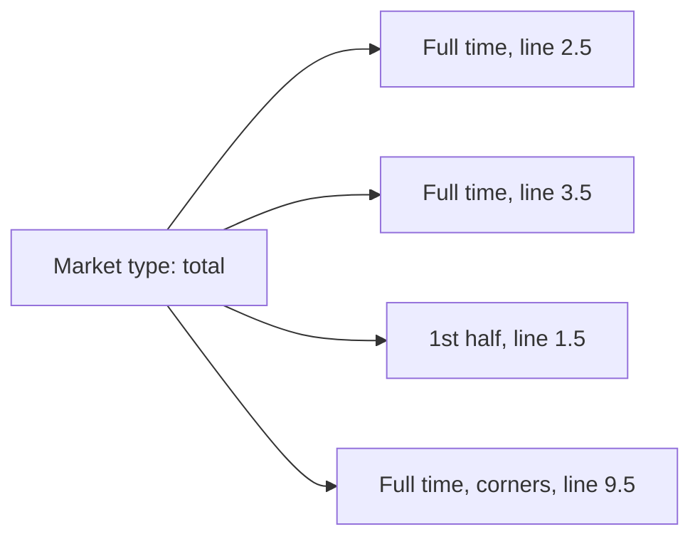

# Taxonomy — the shared lists, in plain language

This page is the **human** map of OpenBook’s shared names. It is not the
technical contract (that is the [spec](../spec/openbook.md)) and it is not
the full id list (that is [vocabularies](../vocabularies/)).

Use this when you need to agree what a word means — product, trading, ops,
legal — before anyone opens a schema.

---

## What is shared vs what a publisher owns

| Shared by the standard (same everywhere) | Each publisher’s own |
| --- | --- |
| Sport (soccer, tennis) and discipline (100 m, Formula 1) | League id, season id, match id |
| Market type (moneyline, total, player points) | Team / player ids |
| Segment (1st half, set 3, Q1) | Venue id |
| Side (home, away, over, under) | How they spell “Man City” |
| Basis (goals, corners, sets) | Wikidata link, when they have one, so others can match |

The shared ids look like `sport:soccer` or `market:total` on the wire. You do
not need those spellings to *talk* about the taxonomy; they are how computers
agree.

Once a shared id is published in a frozen version, it is never reused for
something else. If a name was a mistake, it is deprecated, not quietly
repurposed.

---

## Sport

The game being played. Soccer, basketball, tennis. Not “the Olympics” — that
is a competition (a league, in OpenBook’s terms) that contains many sports.
Not “women’s soccer” either — gender and age group belong to the league, and
the sport stays soccer.

A few sports have **disciplines** underneath: the 100 m inside athletics,
Formula 1 inside motorsport, Counter-Strike inside esports. Those are still
the same sport, sliced finer.

Each sport names its **primary unit**: what a score normally counts. Goals in
soccer, points in basketball, runs in cricket, sets in tennis, time in
athletics. A market that counts something else (corners, cards, games) says so
with a basis.

Horse and greyhound racing have no sport id yet; the racing card is modelled
separately (stalls) until a racing publisher proposes one.

Catch-all: when a publisher sees a sport that is not on the list yet, they
should say “unknown” rather than invent a private code. The list grows by
proposal, one sport at a time, when a real feed prices it.

Full list: [sports vocabulary](../vocabularies/sports.md).

---

## League, season, stage

These are *competitions and their structure*, not the shared taxonomy of
sports — but they sit next to it, so the words stay consistent.

| Word | Means | Example |
| --- | --- | --- |
| League | Any recurring competition | Premier League, FA Cup, F1 World Championship |
| Season | One edition | 2025-26, F1 2026 |
| Stage | A named slice of a season, and stages can nest | Knockout → quarter-final → leg 2 |
| Fixture | The priced event | Arsenal vs Chelsea; F1 Race at Silverstone |
| Organizer | Who runs competitions | UEFA, NBA, FIA — one organizer, many leagues |

---

## Segment

A **segment** is a slice *inside* a match, used both for live state (“we are
in the first half”) and for which slice a bet is on (“first-half total”).

It is **not** a separate match. First half and full time of the same soccer
game are two segments of one fixture. A different session — qualifying and
the race, first leg and second leg, game 3 of a series — is a separate
fixture, not a segment.

Three words do most of the work:

| Word | Means |
| --- | --- |
| Full time | The whole contest as it is graded, including any overtime, extra time, shootout or extra innings the rules allow. Every sport has this slice. |
| Regulation | The scheduled length only — 90 minutes, 60 minutes, four quarters. Listed only where a contest can run past it. |
| A period | One half, quarter, period, set, inning, round, frame, map, hole or lap. A period includes its own stoppage time and excludes overtime. |

| Sport family | Typical slices |
| --- | --- |
| Soccer, handball, rugby, GAA | Halves, extra time, penalties, clock windows |
| Basketball, American football, Aussie rules, netball, hockey on turf or water | Quarters, halves, overtime (numbered where there can be several) |
| Ice hockey, floorball | Periods, overtime, shootout |
| Tennis, volleyball, table tennis, badminton, squash | Sets, sometimes games and tiebreaks |
| Baseball, softball | Innings, first five or seven, extra innings |
| Cricket | Innings, overs, powerplay, super over |
| Boxing, MMA, kickboxing | Rounds |
| Snooker, darts, bowls, curling | Frames, sets and legs, ends |
| Golf | Rounds, front and back nine, holes, play-off |
| Motorsport, cycling | Q1/Q2/Q3 of the qualifying fixture, laps, stages, sprints and climbs |
| Athletics, swimming, skiing | Heats, semi-finals, the final, runs, attempts, splits |
| Esports | Maps or games of a series, rounds inside a map |

Full list: [segments vocabulary](../vocabularies/segments.md).

---

## Market type vs a priced market

Easy to mix up:

| Word | Means | Example |
| --- | --- | --- |
| Market type | The *kind* of bet, shared | Total (over/under) |
| Market | That kind of bet, on this match, this slice, this line, from this book | One book’s 2.5 full-time total on EVT-88213 |
| Side | Which selection | over, under, home, away |
| Line | The number on a handicap or total | 2.5 |
| Basis | What is being counted | goals, corners, sets, maps |

The same market type can be offered on many segments (full time *and* first
half), many lines (2.5, 3.5) and many bases (goals, corners). Those are
different markets, one type. A corner total is not a new kind of bet; it is a
total that counts corners.

### Shape

Every market type has a **shape**: how it is built, which tells a client how
to draw it and a grader how to settle it.

| Shape | Looks like | Example |
| --- | --- | --- |
| Binary | Two sides, one wins | Draw no bet, race to 20 |
| N-way | A list of named sides or participants | Three-way moneyline, outright winner |
| Over/under | A line and two sides | Total, player points |
| Handicap | A line given to one side | Point spread, Asian handicap |
| Correct score | One row per score pair, plus “any other” | Correct score, set betting |
| Exact value | One row per exact count | Reserved; no market uses it yet |
| Yes/no | One question | Both teams to score, anytime scorer |
| Composite | Legs that point at other markets | Parlay, same-game parlay |

### Families of market types

Each family is the market type’s **category** on the wire.

| Family | Category | What the customer is betting | Typical types |
| --- | --- | --- | --- |
| Main lines | `main-line` | Who wins, the handicap, the total | moneyline, spread, total, team total, double chance, to qualify |
| Score props | `score-prop` | The score itself, or a fact about it | correct score, set betting, BTTS, odd/even, winning margin, clean sheet |
| Game props | `game-prop` | Something about how the contest unfolds | first to score, overtime yes/no, HT/FT, round betting, fastest lap |
| Player props | `player-prop` | A person on the roster | player points, passing yards, anytime scorer, batter runs |
| Outrights | `outright` | The competition, not one match | outright winner, top-N finish, to be relegated |
| Same-game parlays | `same-game-parlay` | Several selections from one match, one price | same-game parlay |
| Parlays and specials | `parlay-special` | Selections across matches, and the catch-all | accumulator, unknown |

Full list with ids: [market types vocabulary](../vocabularies/market_types.md).

---

## Side

Which outcome of a market. Sides are a small shared list; a priced market
lists its outcomes as “this side, at these odds.”

| Side | Means | Used by |
| --- | --- | --- |
| home, away | The home participant, the away participant. Home/away is a fact the publisher asserts, not “whichever name came first”. In a head-to-head between two golfers, they are the fixture’s two participants in order. | Moneyline, spread, race to, to qualify |
| draw | A tie stands | Three-way moneyline, 3-way handicap, winning margin, round betting |
| over, under | Above or below the line | Totals, every over/under player prop |
| yes, no | The question is true or false | BTTS, clean sheet, anytime scorer (`no` optional on player boards) |
| odd, even | Parity of the total; zero is even | Total odd/even |
| none | A listed “nobody” selection: no goal scored, no scorer | First to score, first scorer |
| home-or-draw, away-or-draw, home-or-away | Two results in one selection | Double chance |
| participant | A named team or individual; the row says which | Outrights, winning margin, group winner |
| other | The leftover: every result not listed on its own row | Correct score, winning margin, set betting, round betting |

Some rows carry a little more than a side:

| Extra on the row | Means | Used by |
| --- | --- | --- |
| A row line | The exact number this row is about | Winning margin (by exactly 2), round betting (in round 3) |
| At least | A plus band: this many or more | Winning margin (by 3+) |
| Home total and away total | The two halves of a listed score | Correct score, set betting |
| Half time and full time | The two results of an HT/FT pair | Half-time/full-time |
| Player | Which person the row is about | Every player prop |
| Participant | Which team the row is about | Team total, clean sheet, top-N finish |

A few things that look like sides are not. A racing **stall** is its own
object (the gate number is an order, not a side). The cricket **toss** is its
own object (who won it, plus required `elected` `bat` · `bowl`). A live
**series** is the playoff lead, not this game’s score: exactly two `wins`
rows (`participant` + `total` games won); optional `needed` (wins needed
to take the series).

---

## Matching the same match across publishers

Publishers keep their own match ids. Consumers match on:

- sport
- league name and territory
- start time
- participant names and territories
- and a Wikidata link when both sides have one (Arsenal F.C. is the same
  entity everywhere)

Home/away is a fact the publisher asserts, not “whichever name came first in
the file.”

---

## Where the lists live

| List | File |
| --- | --- |
| Market types | [`vocabularies/market_types.md`](../vocabularies/market_types.md) |
| Sports and disciplines | [`vocabularies/sports.md`](../vocabularies/sports.md) |
| Segments | [`vocabularies/segments.md`](../vocabularies/segments.md) |

To add or deprecate an id, see [CONTRIBUTING](../CONTRIBUTING.md).
