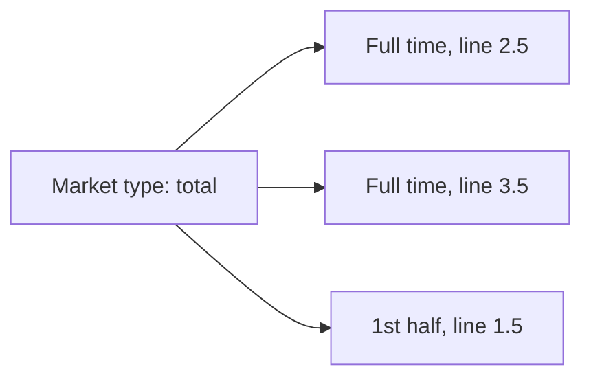

# Taxonomy — the shared lists, in plain language

This page is the **human** map of OpenBook’s shared names. It is not the
technical contract (that is the [spec](../spec/openbook.md)) and it is not
the full id list (that is [vocabularies](../vocabularies/)).

Use this when you need to agree what a word means — product, trading, ops,
legal — before anyone opens a schema.

---

## What is shared vs what a publisher owns

| Shared by the standard (same everywhere) | Each publisher’s own |
| --- | --- |
| Sport (soccer, tennis) | League id, season id, match id |
| Market type (moneyline, total, player points) | Team / player ids |
| Segment (1st half, set 3, Q1) | Venue id |
| Position (goalkeeper, shortstop) | Shirt number |
| Side (home, away, over, under) | How they spell “Man City” |
| | Wikidata link, when they have one, so others can match |

The shared ids look like `sport:soccer` or `market:total` on the wire. You do
not need those spellings to *talk* about the taxonomy; they are how computers
agree.

Once a shared id is published in a frozen version, it is never reused for
something else. If a name was a mistake, it is deprecated, not quietly
repurposed.

---

## Sport

The game being played. Soccer, basketball, tennis. Not “the Olympics” — that
is a competition (a league, in OpenBook’s terms) that contains many sports.

A few sports have **disciplines** underneath (100 m, marathon; a video-game
title under esports). Those are still the same sport, sliced finer. A
series (Formula 1, a Grand Tour, Worlds) is a league, not a sport.

Catch-all: when a publisher sees a sport that is not on the list yet, they
should say “unknown” rather than invent a private code. The list grows by
proposal. Horse racing has no sport id in this draft; use unknown until one
is proposed.

Each sport has a default scoring unit (goals, points, runs, …). A priced
market can count something else by setting `basis` — corners on a soccer
total is still a total, not a new market type.

Full list: [sports vocabulary](../vocabularies/sports.md).

---

## League, season, stage

These are *competitions and their structure*, not the shared taxonomy of
sports — but they sit next to it, so the words stay consistent.

| Word | Means | Example |
| --- | --- | --- |
| League | Any recurring competition | Premier League, FA Cup, F1 World Championship |
| Season | One edition | 2025-26, F1 2026 |
| Stage | A named slice of a season, and stages can nest | Knockout → quarter-final → leg 2 |
| Fixture | The priced event | Arsenal vs Chelsea; F1 Race at Silverstone |
| Organizer | Who runs competitions | UEFA, NBA, FIA — one organizer, many leagues |

---

## Segment

A **segment** is a slice *inside* a match, used both for live state (“we are
in the first half”) and for which slice a bet is on (“first-half total”).

It is **not** a separate match. First half and full time of the same soccer
game are two segments of one fixture. Qualifying, sprint and race in
motorsport *are* separate fixtures; Q1/Q2/Q3 are segments of the qualifying
fixture.

Every sport has **full time**: the whole contest as graded, including
overtime or extra time when the league’s rules say they count. Regulation
is the same contest without those extensions, where books price the
difference.

| Sport family | Typical slices |
| --- | --- |
| Soccer / rugby / futsal / handball | 1st half, 2nd half, full time, extra time, penalties |
| Basketball / American football / Australian rules / lacrosse | Quarters, halves, overtime |
| Ice hockey | Periods, overtime, shootout |
| Baseball | Innings, first five, first seven, extra innings |
| Tennis / volleyball / badminton / table tennis | Sets, sometimes games or a tie-break |
| Cricket | Full time, innings, overs, powerplay |
| Golf | Rounds, front nine, back nine, holes |
| Fights (MMA, boxing) | Rounds |
| Snooker / darts | Frames, or sets and legs |
| Motorsport | Q1/Q2/Q3 and laps *inside* one session fixture |
| Athletics / swimming | The fixture’s result as full time; heats and attempts when priced |
| Esports | Maps or games of one match |

Full list: [segments vocabulary](../vocabularies/segments.md).

---

## Position

A **position** is a roster slot on a `player` record (goalkeeper, shortstop),
not a scoring unit and not a segment. Shared ids look like
`position:soccer:forward`. Sports without a list still use the field; unknown
values are allowed. Catch-all: `position:unknown:unknown`.

Full list: [positions vocabulary](../vocabularies/positions.md).

---

## Market type vs a priced market

Easy to mix up:

| Word | Means | Example |
| --- | --- | --- |
| Market type | The *kind* of bet, shared | Total (over/under) |
| Market | That kind of bet, on this match, this slice, this line, from this book | 2.5 full-time total on a named fixture from one source |
| Side | Which selection | over, under, home, away |
| Line | The number on a handicap or total | 2.5 |
| Basis | What is being counted | goals, corners, maps |

The same market type can be offered on many segments (full time *and* first
half) and many lines (2.5, 3.5). Those are different markets, one type.

### Families of market types

These names are the `category` on a market-type document.

| Family | What the customer is betting | Typical types |
| --- | --- | --- |
| Main line | Who wins, the handicap, the total | moneyline, spread, total, team total, draw no bet, double chance |
| Score prop | The exact or special score | correct score, exact total, BTTS, clean sheet, odd/even, winning margin |
| Game prop | How the game unfolds | first to score, overtime yes/no, method of victory, HT/FT |
| Player prop | A person on the roster | player points, anytime scorer, passing yards, wickets |
| Outright | The competition, not one match | outright winner, group winner, head to head, podium |
| Same-game parlay / parlay | Several selections glued together | same-game parlay, accumulator |

**Shape** is how the board is built: two-way, n-way, over/under, handicap,
exact value, correct score, yes/no, or **composite** (a parlay that points at
other outcomes). Shape is not the same as category.

Full list with ids: [market types vocabulary](../vocabularies/market_types.md).

---

## Side

Which outcome of a market. A priced market lists its outcomes as “this
side, at these odds.”

| Side | Used when |
| --- | --- |
| home / away / draw | Moneyline, draw no bet, and any two- or three-way result |
| over / under | Totals and player over/unders |
| yes / no | BTTS, overtime, podium, anytime scorer |
| odd / even | Total odd/even |
| none | A listed “nobody” selection (nobody scores). Not leftover. |
| other | Leftover unlisted scores or unlisted remainder on winning margin. Not used on yes/no player boards. |
| home-or-draw / away-or-draw / home-or-away | Double chance |
| participant | A named team, player, number, round, or method, depending on the market |

Extra fields on a row, not sides: listed correct score carries `homeTotal` /
`awayTotal`. HT/FT carries `halfTime` / `fullTime`. Winning margin is
`participant` plus outcome `line` (exact) or `atLeast` (3 or more). Player
over/under and yes/no player name `player`. Yes/no player omits market
`line`; leftover `other` is not used.

| Extra on the row | Means | Used by |
| --- | --- | --- |
| A row line | The exact number this row is about | Winning margin (by exactly 2), round betting (in round 3) |
| At least | A plus band: this many or more | Winning margin (by 3+) |
| Home total and away total | The two halves of a listed score | Correct score, set betting |
| Half time and full time | The two results of an HT/FT pair | Half-time/full-time |
| Player | Which person the row is about | Every player prop |
| Participant | Which team the row is about | Team total, clean sheet, top-N finish |

A few things that look like sides are not. A racing **stall** is its own
object (the gate number is an order, not a side). The cricket **toss** is its
own object (who won it, plus required `elected` `bat` · `bowl`). A live
**series** is the playoff lead, not this game’s score: exactly two `wins`
rows (`participant` + `total` games won); optional `needed` (wins needed
to take the series).

---

## Matching the same match across publishers

Publishers keep their own match ids. Consumers match on:

- sport
- league name and territory
- start time
- participant names and territories
- and a Wikidata link when both sides have one (Arsenal F.C. is the same
  entity everywhere)

Home/away is a fact the publisher asserts, not “whichever name came first in
the file.”

---

## Where the lists live

| List | File |
| --- | --- |
| Market types | [`vocabularies/market_types.md`](../vocabularies/market_types.md) |
| Sports | [`vocabularies/sports.md`](../vocabularies/sports.md) |
| Segments | [`vocabularies/segments.md`](../vocabularies/segments.md) |
| Positions | [`vocabularies/positions.md`](../vocabularies/positions.md) |

To add or deprecate an id, see [CONTRIBUTING](../CONTRIBUTING.md).
