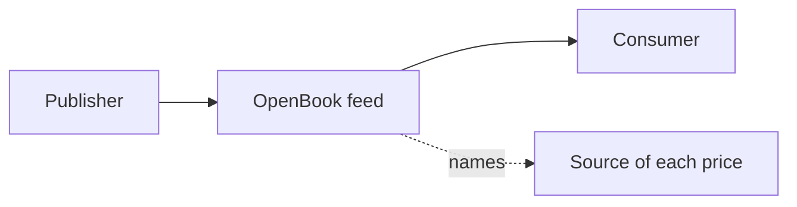
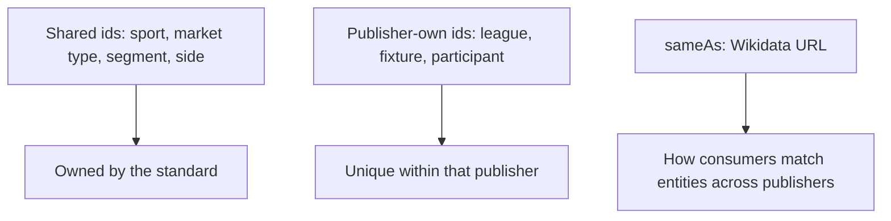
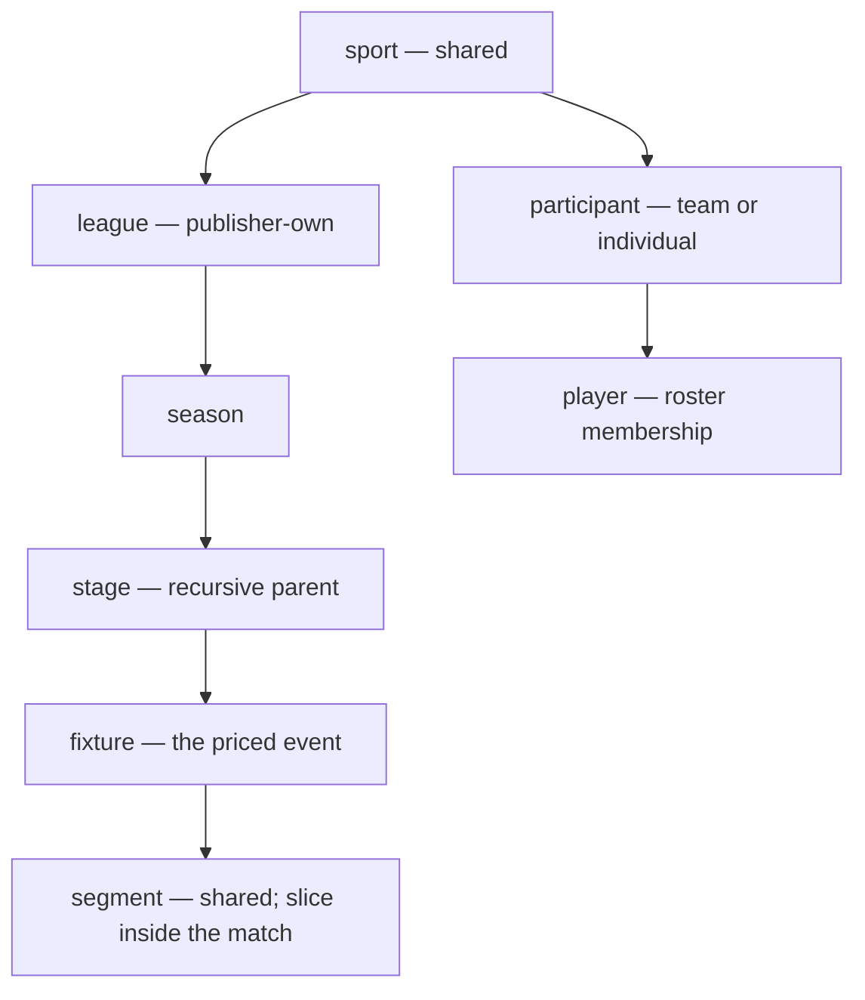
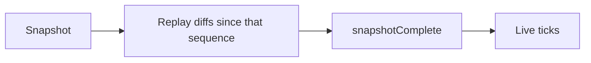
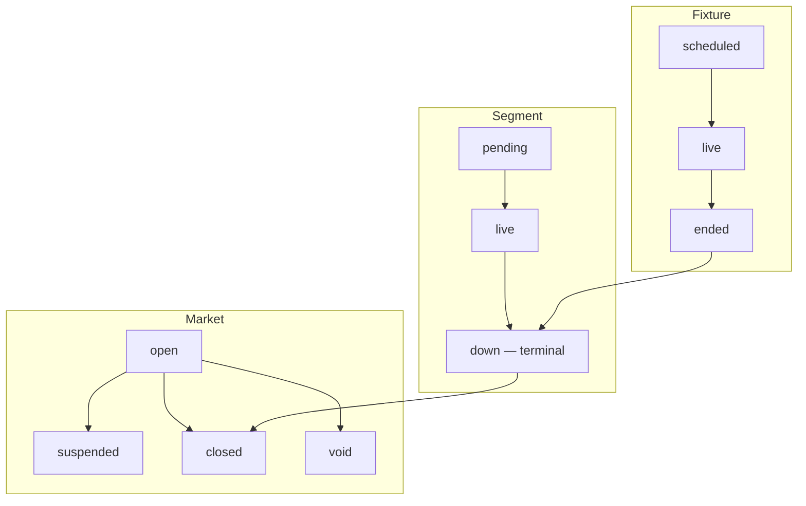
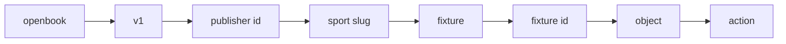

# OpenBook — the specification

The normative document defining the **OpenBook** standard.
Version `0.3.0-draft` · 2026-09-12

> **How to read this.** This page is the technical contract. For a
> non-technical walkthrough see the [guide](../docs/guide.md). For shared
> names (sports, market types, segments) see the
> [taxonomy](../docs/taxonomy.md) and the [id lists](../vocabularies/).

The JSON Schemas in [`../schema/`](../schema/) are the machine-normative field
definitions; where prose and schema disagree, the schema wins. Every rule here
traces to a decision in [`../docs/decisions.md`](../docs/decisions.md).
Keywords **MUST**, **SHOULD**, **MAY** are used per RFC 2119.

---

## 1. What OpenBook is

OpenBook is **one shared format any publisher emits sportsbook data in**, the
way any transit agency publishes GTFS. It applies whenever odds that originate
from a sportsbook are emitted externally — by the sportsbook itself or by a
feed that carries them.

| Term | Meaning |
| --- | --- |
| Publisher | Whoever transmits an OpenBook feed |
| Source | Whose odds a price is. Every price carries its source; one feed MAY carry many sources (as one GTFS feed carries many agencies) |
| Consumer | Reads any number of OpenBook feeds with one importer |

OpenBook is independent of any sportsbook, data provider or software vendor.
It standardises the data contract only.

## 2. Conventions

| Topic | Rule |
| --- | --- |
| Time | RFC 3339 (ISO 8601 with an explicit offset), everywhere |
| Currency | ISO 4217. Each feed MUST declare **`baseCurrency`** once on the publisher record (and on a full snapshot of that record). Incremental messages do not repeat it. Money is `{amount}` in that currency. Odds are not money. Another currency is another subscription (Q44). ISO 20022 XML and the ISO 20022 JSON trial are not the OpenBook encoding (Q92) |
| Encoding | JSON is the required v1 encoding (Q89). The schemas, examples, discovery document, corpus, validator, and AsyncAPI describe this encoding. Additional encodings MAY exist later as optional bindings generated from the JSON Schemas; they are not in this repo in v1 and they do not replace JSON |
| Language | ISO 639-1 |
| Territory | Unicode CLDR: ISO 3166-1 alpha-2 (`GB`), ISO 3166-2 for sub-national teams (`GB-ENG`, `US-PR`), CLDR extras (`XK`) |
| Odds and lines | Decimal **strings** on the wire, not JSON numbers. Decimal odds only (MUST be strictly greater than 1). American and fractional forms are presentation |
| Text | UTF-8; names keep their diacritics |
| Field names | camelCase, and **schema.org's name wherever schema.org has the property**: `startDate`, `dateModified`, `datePublished`, `alternateName`, `sameAs`, `identifier`, `superEvent`, `organizer`, `location`. Small shared vocabularies are `*Type` fields: `competitionType`, `participantType`, `marketType`, `stageType`, `sourceType`. Documents MAY carry JSON-LD `@context` / `@type`, so an OpenBook document is also valid schema.org data |
| Bounds | Shared primitives are length- and size-bounded (id, decimal, and name lengths; alias and identifier list sizes) in [`../schema/common.schema.json`](../schema/common.schema.json), so a conformant parser rejects oversized input instead of trusting it |
| Version | Every object and message carries `openbookVersion` |

## 3. Identifiers

Three layers. They are not interchangeable.

### 3.1 Shared ids — the vocabularies

Sports, segments, market types and sides use ids owned by the standard, in two
equivalent spellings:

| Form | Example |
| --- | --- |
| Short, on the wire | `sport:soccer`, `market:total`, `segment:soccer:1st-half`, `side:home` |
| Formal, in the spec | `urn:openbook:sport:soccer` |

Lowercase, `:`-separated, `-` inside a segment. Once published in a frozen
version, never re-pointed, removed, or **reassigned**; only deprecated (Q35).
Field names and list-values take the same promise. Deprecation is `name` +
`reason` + `replacement` + `sunset`; removal from the live set only at MAJOR
after the window (Q36).

Human map: [`../docs/taxonomy.md`](../docs/taxonomy.md). Lists:
[`../vocabularies/`](../vocabularies/).

### 3.2 Publisher-own ids — the entities

Leagues, seasons, stages, fixtures, participants, players and venues carry the
**publisher's own id**, unique within that publisher. OpenBook mints none.

### 3.3 Shared entity id — `sameAs` (Wikidata)

For leagues, participants, venues and territories, **`sameAs`** holds the
Wikidata entity URL (`https://www.wikidata.org/entity/Q9617`) — the shared
cross-publisher entity id: **REQUIRED when one exists, `null` when it does
not**. A string to pin, never a runtime dependency.

### 3.4 External ids — `identifier`

Any object MAY carry `identifier`: a list of schema.org `PropertyValue`
(`{propertyID, value}`). Optional, never canonical.

## 4. The hierarchy

| Object | Who owns the id | Notes |
| --- | --- | --- |
| sport | shared vocabulary | |
| league | publisher | `competitionType`: league · cup · tournament · series · exhibition |
| season | publisher | one edition (2025-26, F1 2026) |
| stage | publisher | named slice of a season; recursive `parent` with `stageType` |
| fixture | publisher | the priced event |
| segment | shared vocabulary | slice *inside* a match (1st half, set 3, Q1) |
| participant | publisher | team *or* individual; belongs to a sport; linked to leagues only through fixtures |
| player | publisher | roster membership of a person in a team (lineups, player props) |

- A **league** is any recurring competition — the Premier League, the FA Cup,
  the NBA Cup, the F1 World Championship — typed by `competitionType`. It MAY
  name an `organizer` (the NBA, UEFA, the FIA): one organizer runs several
  competitions.
- A **participant** is a team *or* an individual (`participantType`); a tennis
  player, an F1 driver, a golfer is a participant. It belongs to a sport, never
  to a league: the same team plays the league, the cup and the continental
  competition in one week. `player` exists only as roster membership.
- A **stage** is recursive: Champions League → *Knockout* (phase) →
  *Quarter-final* (round) → *Leg 2* (leg); NBA → *Playoffs* (phase) →
  *Conference Semifinals* (round) → *Game 3* (seriesGame). A fixture names its
  **leaf** stage; the chain is walked via `parent`.
- In Formula 1, Qualifying, Sprint and Race are three **fixtures** in one
  round; their sessions (Q1/Q2/Q3) are **segments**.

## 5. Change: everything is diff-able

- Every object and message carries **`sequence`** — a monotonic integer the
  publisher's server issues per feed — and **`dateModified`**.
- **Push** streams (§8) send changes only. **Pull** endpoints accept
  `since=<sequence>` and return only what changed after it. `since` is never a
  timestamp.
- A **snapshot** is the state as of a sequence, for initial load and recovery;
  a diff from zero, not a separate format.
- **Field-level granularity, JSON Merge Patch (RFC 7386) semantics**: a change
  carries the object id plus only the fields that changed; absent = unchanged;
  `null` = removed. Consumers MUST merge and MUST NOT assume a message re-sends
  unchanged state. JSON Patch (RFC 6902) is not an alternate change encoding
  (Q91).
- **Odds are push-first.** Publishers SHOULD deliver `odds/change` by push and
  MAY additionally offer a `since=` pull. `market/snapshot` gives a fixture's
  current prices for initial load and recovery.

Merge Patch in one line:

| In the change | Meaning |
| --- | --- |
| Field present | Set to this value |
| Field absent | Unchanged |
| Field `null` | Removed (tombstone) |

### 5.1 Delivery and recovery (Q33)

A publisher that claims Level L MUST honour all eight. These are protocol
guarantees, not JSON Schema.

| # | Guarantee | Rule |
| --- | --- | --- |
| 1 | Retention horizon `R` | `since=N` with `N ≥ R` MUST return a complete, ordered delta. `N < R` MUST respond HTTP **410** with RFC 9457 Problem Details pointing at the snapshot URL — not a 200 with a flag, and not a silent full snapshot (Q46) |
| 2 | Snapshot is compaction | Merge Patch `null` is a tombstone. Replaying snapshot + diffs MUST converge on the same document as a fresh snapshot |
| 3 | Ordering is per fixture | `sequence` is per publisher, strictly increasing, unique. For one fixture, messages appear in increasing sequence. Cross-fixture display order is not guaranteed |
| 4 | Caught-up (push) | After snapshot + replay, the publisher MUST emit `action: snapshotComplete` on that stream, with `changes: {}`. Pull has no marker; the HTTP response *is* the batch (Q46) |
| 5 | Bounded heartbeats (push) | The same stream carries `action: heartbeat` (`changes: {}`). The publisher record MUST declare `heartbeatMs` (maximum silence, milliseconds). Quiet longer than that, the consumer SHOULD treat the feed as down (Q46). FIX session (Logon / Heartbeat / TestRequest / Logout) is not the OpenBook session (Q93) |
| 6 | Conflated ticks | If intermediate ticks are dropped, that change MUST carry **`conflated`: `true`**. Sequence still increases (Q47) |
| 7 | QoS 0 / 1 / 2 | Delivery vocabulary (at-most-once / at-least-once / exactly-once). MQTT is not required; other transports MUST name the equivalent |
| 8 | Dedup key | `(publisher, sequence)`. Consumers MUST ignore duplicates |

### 5.2 Feed operations (Q41, Q48, Q49)

- Live documents SHOULD declare **`ttl`**: integer seconds, GBFS (Q48).
  Optional on the publisher record; required on the discovery document.
- A publisher SHOULD offer **one discovery URL** that returns
  `{ lastUpdated, ttl, feeds: [{ name, url, kind, id, schemaUrl }] }`
  ([`../schema/discovery.schema.json`](../schema/discovery.schema.json)).
  Snapshot, stream, publisher-hosted API docs, and additional surfaces
  (MCP, plugins) are named feeds. The `publisher` object stays identity, not
  the catalog (Q49, Q56).
  Documents are not wrapped in a GBFS-style outer container (Q90).
  There is no spec-owned list of many publishers (Q94).
- A publisher MAY **co-serve** more than one OpenBook version at the same
  time (distinct URLs or topics per `openbookVersion`).

### 5.3 Additional surfaces: MCP and plugins (Q56)

OpenBook standardises the **sportsbook data contract**. MCP servers, Agent
Plugins, and other client tooling are **additional surfaces**: they are
advertised on the same discovery document, and they MUST NOT invent a
second betting model.

- Each discovery entry SHOULD carry **`kind`**: `snapshot` · `stream` ·
  `docs` · `mcp` · `plugin`. `name` and `url` stay required. `kind` is
  optional so existing catalogs remain valid; new catalogs SHOULD set it.
  Consumers MUST ignore unrecognised `kind` values (Q34, Q37).
- **`snapshot`**, **`stream`**, **`docs`** are OpenBook surfaces. `docs` is
  the publisher's own OpenAPI, AsyncAPI, or HTML (Q54).
- **`mcp`** — `url` MUST be that MCP server's **manifest** (the MCP Registry
  `server.json`, or the conventional `/.well-known/mcp.json` that holds the
  same body). Connection details (stdio, Streamable HTTP, SSE), packages,
  and remotes live in that document. OpenBook does not wrap MCP, does not
  ship MCP's schema, and does not put MCP on the change envelope or topic
  grammar (same rule as CloudEvents, Q52).
- **`plugin`** — `url` MUST be that plugin's **manifest** (for example an
  Agent Plugins `plugin.json`). OpenBook does not define plugin file layout.
- **`schemaUrl`** SHOULD be set on `mcp` and `plugin` entries: the URI of
  the schema that governs the document at `url` (for example the MCP
  Registry server schema, or the Agent Plugins plugin schema). Omit it on
  `snapshot` / `stream` (those validate against this spec).
- **`id`** MAY distinguish several `mcp` or `plugin` entries from one
  publisher.
- An MCP server or plugin that exposes OpenBook data MUST use OpenBook
  document shapes (the schemas in [`../schema/`](../schema/)) as the
  payload. Tools MAY name OpenBook `object` / `action` pairs; they MUST
  NOT replace `market`, `odds`, `score`, or `grade` with a parallel schema.
  Vendor extras stay `x_`-prefixed (Q37).

Two independent implementations (a producer and a consumer; not
[`../tools/validate.py`](../tools/validate.py)) are required to **freeze
1.0**, not to ship a 0.x minor.

### 5.3 Monitoring a feed

The §5.1 guarantees are also the signals a consumer watches to know a feed is
healthy, not only what it replays:

| Signal | What to watch |
| --- | --- |
| Liveness | Silence longer than the publisher's declared `heartbeatMs` (§5.1.5) SHOULD raise an alarm. Quiet is not dead only up to that bound |
| Continuity | A gap, reorder, or duplicate in per-fixture `sequence` (§5.1.3, §5.1.8) is observable and SHOULD be surfaced, never hidden |
| Freshness | `datePublished` / `dateModified` and the discovery document's `lastUpdated` and `ttl` (§5.2) bound how old a live feed may be before a consumer treats it as stale |
| Conformance | A consumer MAY run the conformance corpus ([`../conformance/`](../conformance/)) against a live feed continuously — the same runner CI uses — to catch a producer drifting off-spec. Conformance is a monitoring tool, not only a release gate |

## 5a. Status: three questions, three fields

| Question | Field | Values |
| --- | --- | --- |
| Is the event happening? | Fixture `eventStatus` | scheduled · delayed · live · paused · suspended · postponed · ended · cancelled, with optional `statusReason`. **`ended` happens once.** |
| Where is the match, and is this slice final? | Segment status on the score | pending · live · paused · **down** (+ `downAt`). **A segment goes down once. `down` is terminal** — no reopen and no second down; a validator MUST reject one |
| Can you bet it? | Market `status` per source | open · suspended · closed · void, via `market/update`. Grading is not a market status; it is the `grade` object |

**Taking a market off the board is `marketStatus`** (`suspended` · `closed` ·
`void`). Last odds MAY stay on the document. Dropping an outcome or price from
the snapshot is Merge Patch **`null`** (tombstone). Never a sentinel price
(`odds: "0"`).

Rules: `eventStatus: ended` ⇒ every segment `down`. A market whose segment is
`down` MUST be `closed` or `void`. A `grade` MAY only reference a `down`
segment. `segmentStatus: paused` is halt on the field, not odds offline.
A period taken off the board is a fan-out of `marketStatus` on markets with
that `segment` (Q99). Prefer the affected markets; bulk only when the book
took the whole period down. Progress lives on `score`, not on odds. There
is no betting-open flag on the fixture or the segment. Graded is the `grade`
object, not `marketStatus`.

**Corrections without settling twice** (Q31): a downed segment's
`status` and `downAt` never change. A publisher correcting a result sends
`score/update` with `correction: true` and a `statusReason` — an erratum, not a
second settlement. Grades built on the old values are `grade/delete`d and
re-issued with `supersedes`, pointing (`basedOn`) at the correction's sequence.

## 6. Standard facts (matching across publishers)

Every fixture MUST carry the facts below. Consumers match on sport + league
(name, territory) + start time + participants (names, territories), and on
Wikidata QIDs when both sides have them. `role` and `order` are facts the
publisher asserts; the sign of a handicap is derived from them. A feed's
presentation order is never a fact.

| | Field | Notes |
| --- | --- | --- |
| MUST | `id` | publisher's own |
| MUST | `sport` | shared id + name |
| MUST | `league` | own id + name + territory + `competitionType` |
| MUST | `startDate` | |
| MUST | `participants[]` | own id, name, territory, **`role`** (home · away · neutral) **and `order`**, always present. MAY carry `seed` |
| MUST | `sequence`, `dateModified` | |
| MAY | `season`, `stage`, `location`, `surface`, `identifier` | |

## 7. Objects

Each reference document carries `openbookVersion`, `id`, `sequence`,
`dateModified`; exact types in the schemas. Catalogue objects are the
fixture list. Live objects are the board that keeps moving.

### 7.1 Catalogue

| Object | What it is |
| --- | --- |
| `publisher` | Who transmits, `baseCurrency` (ISO 4217, once per feed), and the `sources[]` the feed carries (`id`, `name`, `sourceType` of sportsbook, exchange, or model). GTFS agency.txt. Another currency is another subscription (Q44). Level L MUST declare **`heartbeatMs`**. Optional **`ttl`** (seconds) MAY also sit here; the discovery document is where `ttl` is required (Q46, Q48). Optional `registeredName` (Q60) and `inLanguage` (ISO 639-1, Q68) |
| `sport`, `segment`, `marketType`, `side` | Shared vocabularies ([`../vocabularies/`](../vocabularies/)). A sport MAY carry a default `limit`. Sport, market type, and segment are **`name` only** (Q59). A market type carries `shape` (`binary` · `n-way` · `over-under` · `handicap` · `exact-value` · `correct-score` · `yes-no` · `composite`, the last for parlay legs that reference other market outcomes) and `category` |
| `region` | `id` = CLDR territory code; `name`, `names{lang}`, `superEvent`, crosswalks `iocCode`, `fifaCode`, `sameAs` |
| `league` | Own id, `name`, `sport`, `territory`, `competitionType`, optional `organizer`, `ruleset`, `sameAs`, optional `limit`. Team-style names: optional `shortName`, `registeredName` (Q59). Optional `gender` (`men` · `women` · `mixed` · `open`) and `ageGroup` (Q72, Q73) |
| `season` | Own id, `league`, `name` (display), `startDate`, `endDate` (Q60 / Q9) |
| `stage` | Own id, `season`, `name`, `parent`, `stageType` (phase · group · round · matchday · leg · seriesGame), `order`, optional `startDate` / `endDate` |
| `participant` | Own id, `participantType` (team · individual), `sport`, `territory`, `sameAs`. Required `name` (popular/board). Optional `shortName`, `names` (ISO 639-1), `nameLatin` (ISO 9 / ISO 843), `alternateName[]`. **Teams** MAY add `location` + `nickname`, `registeredName`, `abbreviation`. **Individuals** MAY add `givenName` / `familyName` (vCard RFC 6350 / ITU X.520); no `abbreviation`. No league field. Fixture `participants[]` copies `name` plus `role` and `order` |
| `player` | Roster membership: own id, `participant` (the person), `team` (the team participant), `position`, `number`. Optional `throws` and `bats` (`left` · `right` · `both`). No name fields |
| `stall` | Racing gate for one runner in one race (Q141–Q144): own id, `fixture`, `participant`, `order` (the gate, 1-based). Not on the generic fixture or `participant` row. No horse-racing sport id in this pick (`sport:unknown` if needed, Q34) |
| `toss` | Cricket toss (Q142–Q144, Q157–Q160): own id, `fixture`, `participant` (who won), required `elected` (`bat` · `bowl`). Not on the generic fixture. Not `score`. `elected` is leftover English; not player `bats` |
| `fixture` | §6 plus `eventStatus`, `cutoffDate`, optional `superEvent` (schema.org; **not** a live/pregame pair — Q101: one fixture, `eventStatus` is live), optional display `name`, `location` (nested schema.org Place: `addressLocality` + `territory`, optional IANA `timeZone`, optional WGS 84 `latitude` / `longitude`), optional `surface` |

### 7.2 Live

| Object | What it is |
| --- | --- |
| `market` | A fixture's market as priced by one source: `fixture`, `marketType`, `segment`, `line`, `source`, `provenance` (`official` · `licensed` · `observed`), `status`, **`limit`** `{amount}` in the feed's `baseCurrency` (required on the market document / snapshot), `outcomes[]` (`side`, `odds`, `line`, `active`). Optional `basis` (same `scoreUnit` list as score/grade). If omitted, sport/league `primaryUnit`. Not a new market type (Q98). Identity: `(source, fixture, marketType, segment, line, basis)`. Correct score, HT/FT, winning margin, and yes/no player (anytime scorer / to score) are one market with many rows and no market `line` (Q107, Q130, Q131). Outcome extras (Q105–Q132, same on `odds/change` and `grade`): listed correct score `homeTotal` + `awayTotal`; leftover `side: other` with neither; HT/FT `halfTime` + `fullTime` (`home` · `away` · `draw` only, always both); listed winning margin `participant` + outcome `line` (exact) or `atLeast` (plus-band; 3 means 3 or more); leftover `side: other` still allowed on winning margin when they did not list a plus-band (Q124); player over/under `player` (OpenBook id) and a market `line`; yes/no player `player` plus `yes` / `no` (`no` optional; leftover `other` is not used, Q127–Q129). A row does not mix those boards (`atLeast` not with `homeTotal` / `halfTime` / `player`, Q114). `side` also has `odd`, `even`, `none`, `home-or-draw`, `away-or-draw`, `home-or-away`. `none` is listed, not leftover. Price-only ticks (`odds/change`) do not repeat `limit` unless it changed. **Most specific wins** (Q45): market `limit` → league `limit` → sport `limit`. A priced market MUST resolve to a limit |
| `score` | `fixture`, `eventStatus` (+ `statusReason`), `segments[]` (each `segment`, `status`, `downAt`), `currentSegment`, `clock` (`elapsed` / `remaining` in integer seconds, `running`, broadcast `display`), and `scores[]` — **one line per participant × unit** (`goals`, `corners`, `sets`, `games`, `runs`, `hits`…) with `total` and `bySegment`. The sport / league declares its `primaryUnit`. `server` for racket sports |
| `lineup` | Starting roster `player` ids for one `fixture` (Q80). Not on the catalog fixture. No formation, substitutions, or predicted lineup (Q82) |
| `series` | Live playoff series lead (Q139–Q140, Q148–Q155, Q162–Q165). Fixture-keyed. `stage` is the printed round (`seriesGame`). Not this game’s `score`. Not `competitionType` series. Required `wins`: exactly two rows, this fixture’s two `participant` ids, each with `total` (games won, integer, 0 allowed). A win ticks when this game is down. `wins` is leftover English (not `scores`, not `participants`). Optional `needed`: wins needed to take the series (integer ≥ 1). Leftover English. Not `total`. Not `line` |
| `grade` | The book's judgement for one market × one source, graded from a `down` segment: `gradeId`, `segment`, `marketType`, `line`, `basis` (the unit graded on — Pinnacle's *resultingUnit*, generalised), `basedOn` (the score sequence used), `outcomes[]` with `win` · `lose` · `void` · `half-win` · `half-lose`. Grade outcomes carry the same extras as the priced row (Q106, Q122, Q126–Q132), including `atLeast` and yes/no `player`. Never edited: a correction is `grade/delete` + a new grade with `supersedes` |

## 8. Streams: fixture-first, then object / action

Every message is **one object and one action**; topic and payload say the same
thing. Topics are fixture-first so that *everything about one match* is a
single subscription.

| Scope | Pattern | Objects |
| --- | --- | --- |
| Fixture-scoped | `openbook/v1/<publisher-id>/<sport>/fixture/<fixture-id>/<object>/<action>` | fixture · odds · market · score · grade · lineup · series |
| Entity | `openbook/v1/<publisher-id>/<sport>/<object>/<id>/<action>` | league · season · stage · participant · player · stall · toss |
| Publisher | `openbook/v1/<publisher-id>/publisher/<action>` | publisher |

- **`<action>`** — the JSON enum token: `snapshot` · `create` · `update` ·
  `delete`, plus **`change` (odds only)**, plus control actions
  **`snapshotComplete`** and **`heartbeat`** (Q46). `snapshotComplete` is
  camelCase on both topic and payload.
- **`<sport>`** — the shared slug without prefix (`soccer`).
- Rules (after WMO WIS2): lowercase, `-` inside a level, no dots, unique per
  level; `+` matches one level, `#` the rest; `v1` bumps only on a breaking
  change to the grammar. Exception: `<action>` matches the JSON enum, so
  `snapshotComplete` is mixed-case.

| What you subscribe to | Topic |
| --- | --- |
| Everything about one match | `openbook/v1/acme-feeds/soccer/fixture/EVT-88213/#` |
| One match's price moves | `openbook/v1/acme-feeds/soccer/fixture/EVT-88213/odds/change` |
| Snapshot + replay finished | `openbook/v1/acme-feeds/soccer/fixture/EVT-88213/fixture/snapshotComplete` |
| All soccer price moves, one publisher | `openbook/v1/acme-feeds/soccer/fixture/+/odds/change` |
| Every soccer score update, every publisher | `openbook/v1/+/soccer/fixture/+/score/update` |
| A league record changed | `openbook/v1/acme-feeds/soccer/league/LG-17/update` |
| Feed-wide heartbeat | `openbook/v1/acme-feeds/publisher/heartbeat` |

The same grammar is described for tooling in
[`asyncapi.yaml`](asyncapi.yaml) (Q42). MQTT is not required.

### 8.1 The change envelope

One envelope for every message
([`../schema/change.schema.json`](../schema/change.schema.json)).

| Field | Role |
| --- | --- |
| `openbookVersion` | Which OpenBook version this message is |
| `sequence` | Publisher-issued monotonic integer |
| `datePublished` | When this message went out |
| `publisher` | Who transmitted it |
| `object` | What kind of thing changed |
| `action` | What happened to it |
| `sport` | Shared sport slug |
| `id` | The object's id |
| `changes` | Merge Patch against the object's document schema |

- `odds/change` carries its `markets[]` diff in `changes`
  ([`odds_change.schema.json`](../schema/odds_change.schema.json)).
- `snapshotComplete` and `heartbeat` carry `changes: {}`.
- If intermediate ticks were dropped, that envelope MUST set
  **`conflated`: `true`** (Q47).
- `market/update` MAY carry `msgType` (`alert` · `update` · `cancel`), `reason`
  and `references[]` to prior sequences, after OASIS CAP 1.2.
- A void is a `market/update` to `void`.
- A corrected grade is `grade/delete` + `grade/create` with `supersedes`.

## 9. Extensions

Publishers MAY add `x_`-prefixed fields for vendor-specific extras.

| Side | Rule |
| --- | --- |
| Write (publisher) | Validate **strictly** against the schema (closed when you write) |
| Read (consumer) | MUST ignore unrecognized **fields**, whether `x_`-prefixed or added in a later minor (Q37) |
| Growable lists | `sport:*`, `market:*`, `segment:*`, `side`, `scoreUnit`, `statusReason` have a catch-all (`unknown` / `other`) |
| Unrecognised values | A conformant consumer MUST accept them (carry them; MUST NOT crash) |
| New market types | Adding a market type is not a breaking change (Q34). Publishers SHOULD use the catch-all rather than inventing an id; publisher-side validation MAY warn. New sports, segments and market types are also proposed to the shared vocabularies |

## 10. Conformance

| Level | Meaning |
| --- | --- |
| **R** | Reference documents validate and carry the §6 facts |
| **L** | Messages validate, carry `sequence`, reference only known ids, honour Merge Patch semantics, deliver `odds/change` by push, and honour §5.1 |

The gate is this spec, the JSON Schemas, and the language-agnostic corpus
in [`../conformance/`](../conformance/) (Q40). Valid cases MUST be
accepted; invalid cases MUST be rejected. [`../tools/validate.py`](../tools/validate.py)
is one runner, not a language oracle.

## 11. Versioning

Semantic versioning per [`../VERSIONING.md`](../VERSIONING.md). `-draft`
marks an unfrozen version. Within a frozen major, compatibility is
**FULL-TRANSITIVE** (Q32): minors only add optional fields; the required set
does not shrink or grow. Freezing **1.0** requires two independent
implementations (Q41).
